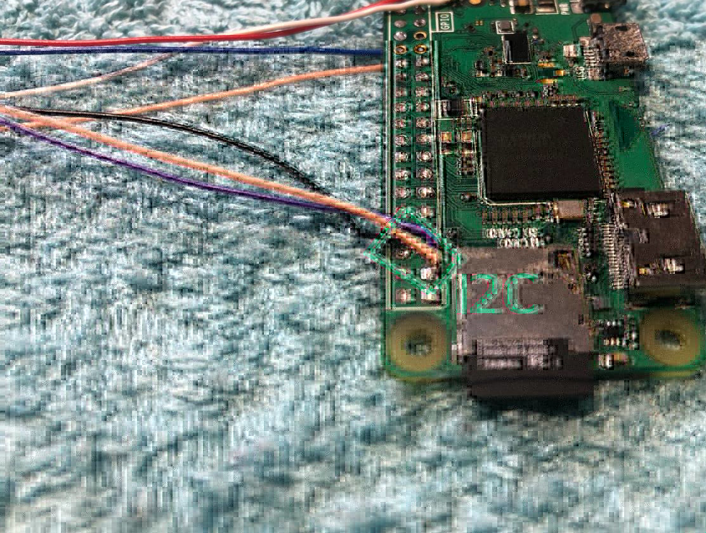
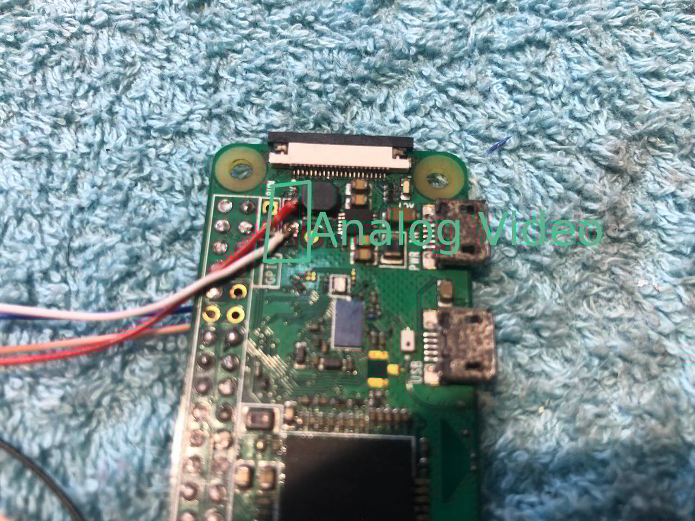
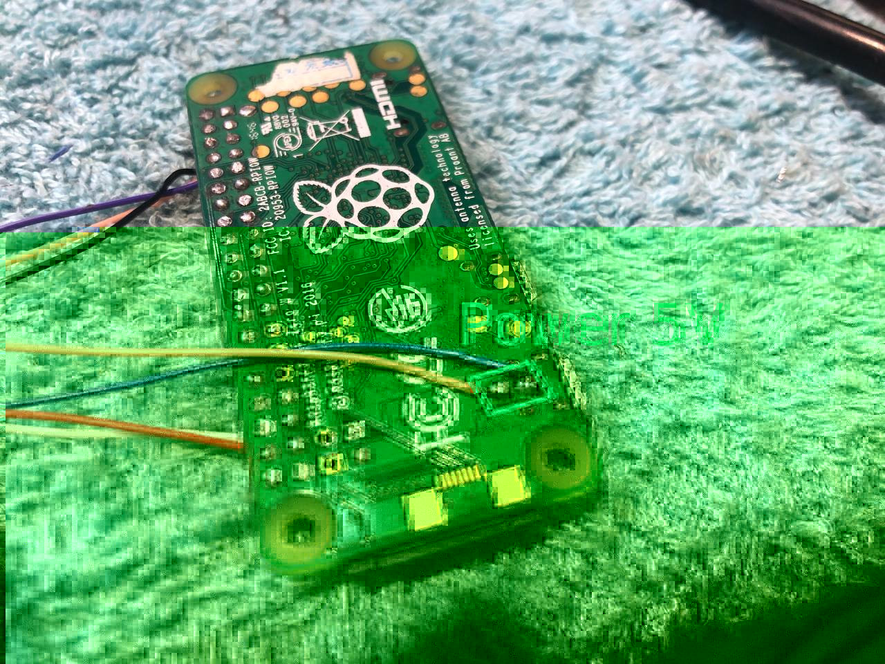
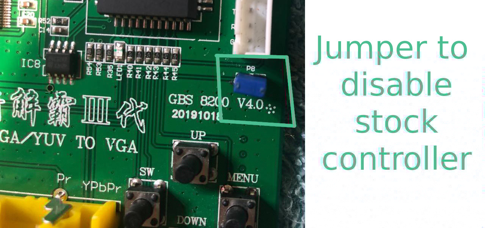
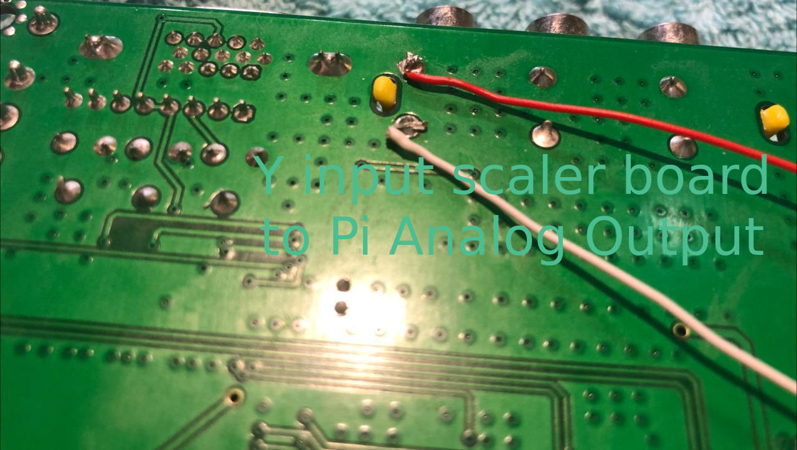
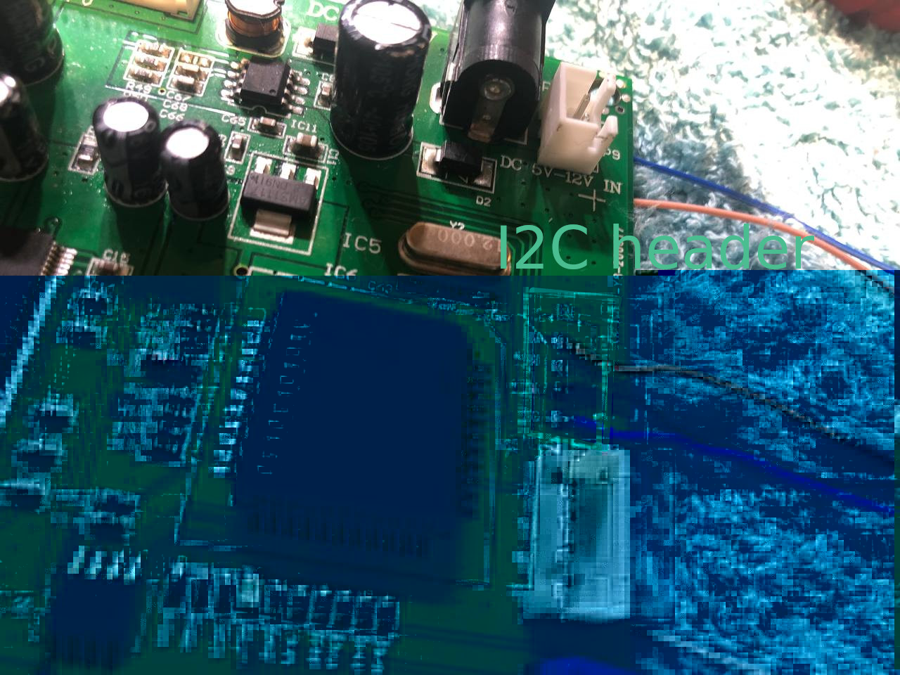
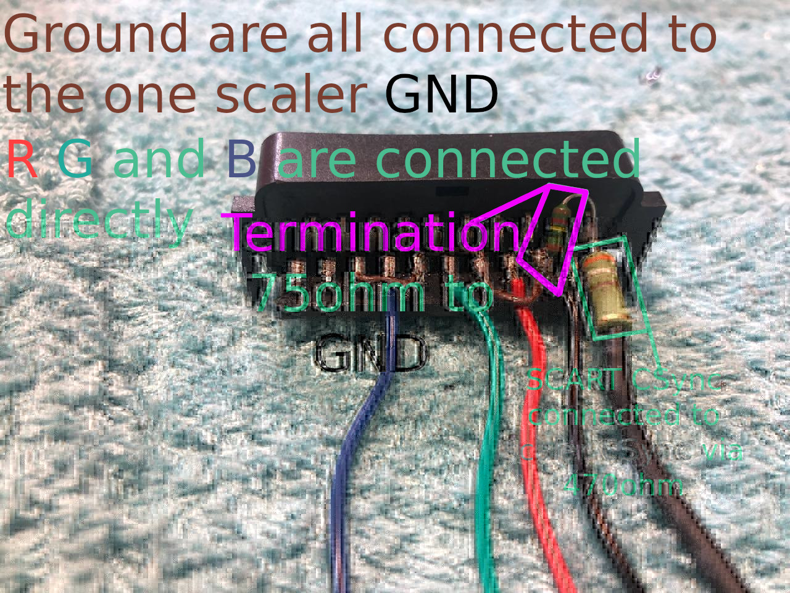

Building The Hardware
===========
  
**Prepping the Raspberry Pi**  
- Solder 3 wires to the I2C pins on your Pi's GPIO (This WILL change depending on which revision of the GPIO your Pi uses, the pins are: SDA, SCL and GND. NOT EEPROM PINS!!!)  
  
- Solder 2 wires to the analog(composite) output to your Pi (header on 0 and 0w, under connector on bigger Pis)  
  
- Connect power wires (you can connect them to the Scaler board input if you plan to use a 5V power supply)  
  
- Connect a keyboard (you can make a keypad using the board of a membrane keyboard if you desire or even make a fancy keypad using a microcontroller)  
  
**Prepping the Scaler Board**  
- Bridge P8 (both a jumper on the pins and a solder bridge at the bottom work)  
  
- Connect the composite out of the Pi to the Y RCA on the scaler (green jack)  
  
- Connect the i2c to the P5 connector on the scaler.  
  
  
**Connecting RGBS (scart)**  
Here is where things differ a bit, a method is using the P11 connector.  
- Connect the wires for R G and B directly to the scart female plug.  
- Connect all the Video GNDs together and connect the GND wire    
- Connect the 75ohm resistor between GND and the scart CSync  
- Option 1 (preferred): Connect pin8 of the LM1881N to VCC, pin4 to GND, pin2 to a leg of one of the 100nf capacitors, connect the other leg to the scart CSync, connect the 470ohm resistor to pin1 and to the CSync wire on the scaler board, finally put the second 100nf between pin4 and pin8. [source](https://tomdalby.com/other/images/GBS8200_v2.png)  
no picture here since I don't have the part.  
- Option 2 (I currently use this and it mostly works): connect the scart CSync to the scaler board CSync using the 470ohm resistor directly  
  
- Connect the audio from the scart to the right connector for your needs (this is signal level audio, too weak for headphone of speakers, this should be connected to some amplifier or an ADC for digital conversion)