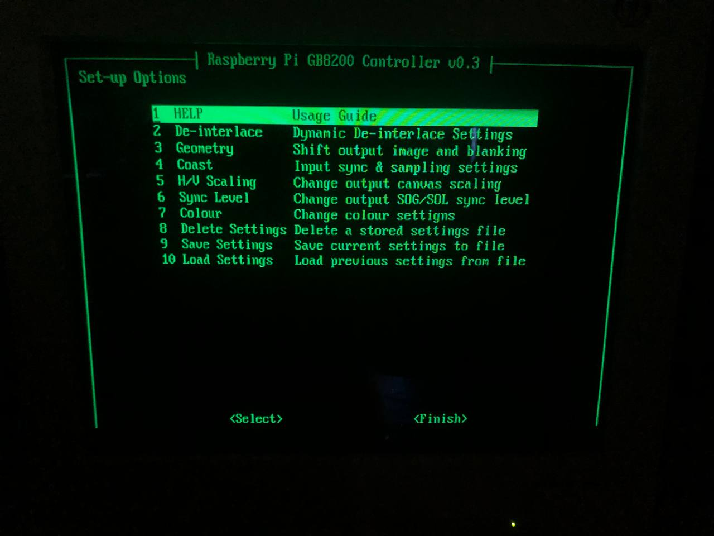
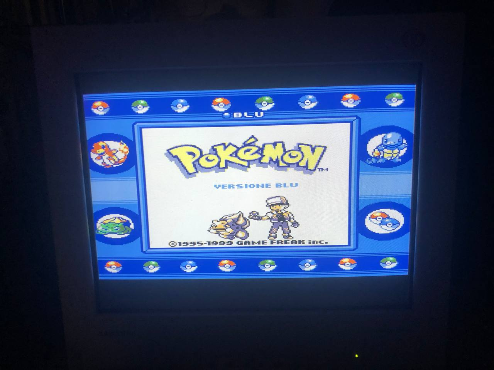
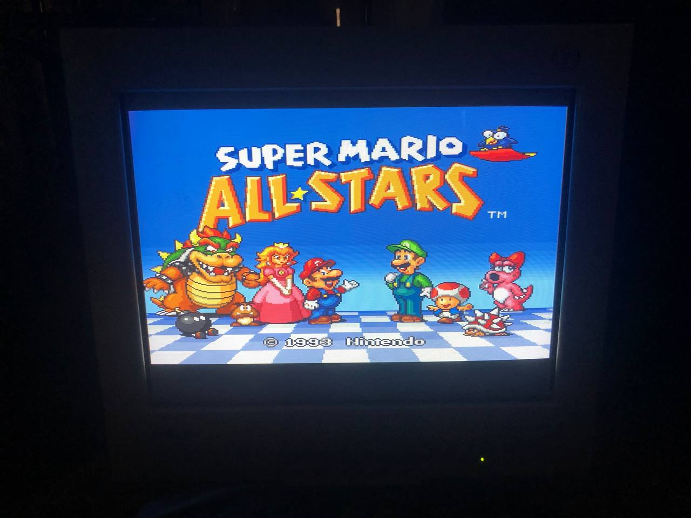

gbs-control
===========
  
RaspberryPi control interface that acts as i2c master to control the Trueview5725 in cheap scaler boards and allows running custom modes.  
  
**What does this allow me to do?**  
This project allows you to control the Trueview5725 directly on the GBS8200, GBS8220, and similar boards.  
  
**What does this mean for me (the end user)?**  
This allows you to have a different OSD for your scaler board and it allows more freedom over the modes it runs.  
  
**What do I need to make this work?**  
You will need:  
- some Linux experience  
- some soldering skills and basic soldering tools  
- some wiring  
- a scart female connector  
- a 75ohm resistor  
- a 470ohm resistor  
- a raspberry pi  
- a board that features a Trueview5725 chip  
- a lm1881n (optional)  
- two 100nf capacitors (optional)  

Full instructions are present on [BUILDINGHW.md](./BUILDINGHW.md)  

**How do I install the Raspberry Pi software?**  
- DD a Raspberry Pi OS Lite image to your SD Card and do the first time setup (you are now required to make your own user and choose your own password)  
- Connect the Pi to the internet  
- run `curl https://raw.githubusercontent.com/paranoidbashthot/gbs-control/master/install-gbs-control.sh | bash` (I highly reccomend to take a look at the script before blindly executing it, it should be fine rerunning the command if you want to update the Pi)  

**Hotkeys**  
Here is a list of hotkeys, you can change them on the thd directory.  
- F1: Toggle OSD  
- F2: Output Mode  
- F5: Quick Save  
- F7: Quick Load  
- Grave or Tilde + (1, 2, 3, 4) Change the OSD output mode (I would stick to 2 and 4)  
- CTRL + (1, 2, 3, 4, 5, 6, 7, 8) +Vertical Size(If Enabled), -Vertical Size(If Enabled), -Horizontal Size, +Horizontal Size, Picture Up, Picture Down, Picture Left, Picture Right.  

**Project in Action**
  
  
